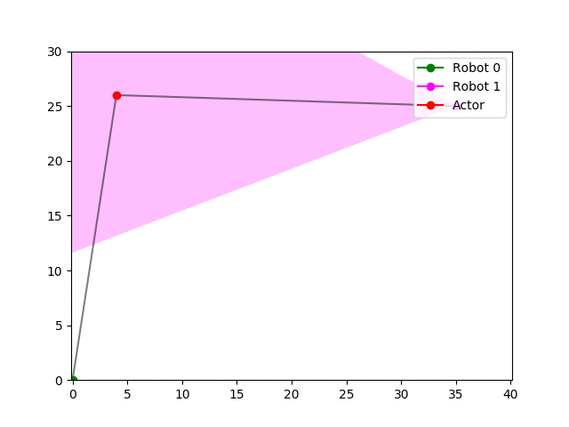
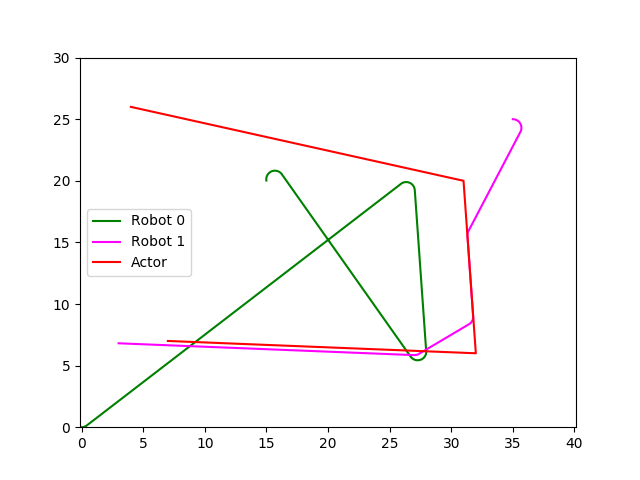
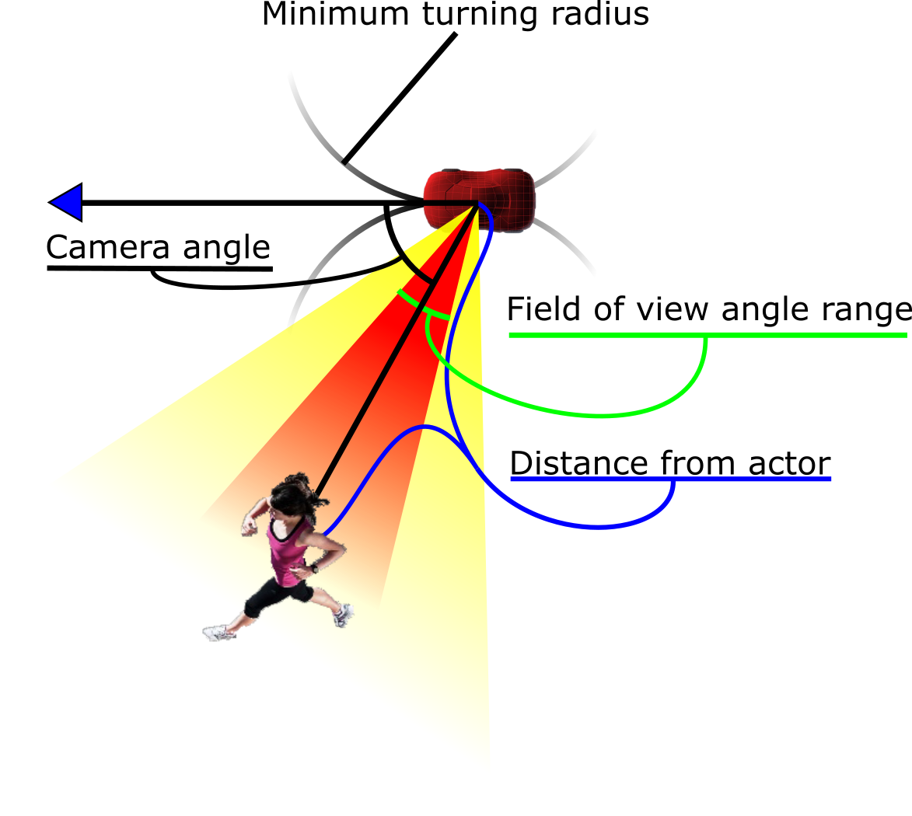

# Camera-robot-path-plan
This is a planning algorithm for planning the path of multiple camera equipt dubins (car-like) robots. It plans a path through an obsticle environment for all of the defined robots, and finds the best way to assign each robot to a set of shots using [Dijkstra's algorithm](https://en.wikipedia.org/wiki/Dijkstra%27s_algorithm), and finds the best way to get to a given shot with the [A* search algorithm](https://en.wikipedia.org/wiki/A*_search_algorithm). It tries to minimize the distance all of the robots have to travel, while still capturing all shots defined.

# Table of Contents
* [Demo](#demo)
* [Installation](#installation)
* [Usage](#usage)

# Demo
``` bash
$ python3 planning.py
```


# Installation
Installing libraries:
``` bash
$ sudo apt install python3 python3-imageio python3-pip
$ sudo python3 -m pip install -U matplotlib dubins
```
Clone the repository:
``` bash
$ git clone https://github.com/jonrietveld/camera-robot-path-plan.git
```

# Usage
## Yaml creation
Follow the format of the 'rocky.yaml' file. When entering values for 'actor' 'path' please enter values in the format (x,y,theta,time). Follow the picture for creating shots.


## Running
Place planning.py in the same directory as your program to be able to import it.

Input your yaml config file into a python dictionary object. Then pass this dictionary object to the 'solve()' method and the solve method will output the same dictionary object it received adding a new dictionary item for each robot called 'path' that contains the solved path for that robot.
``` python
>>> import yaml,planning
>>> input_config = yaml.safe_load(open('path_to_your_config.yaml','r'))
>>> solved_config = planning.solve(input_config)
>>> planning.visualize(solved_config)
```
